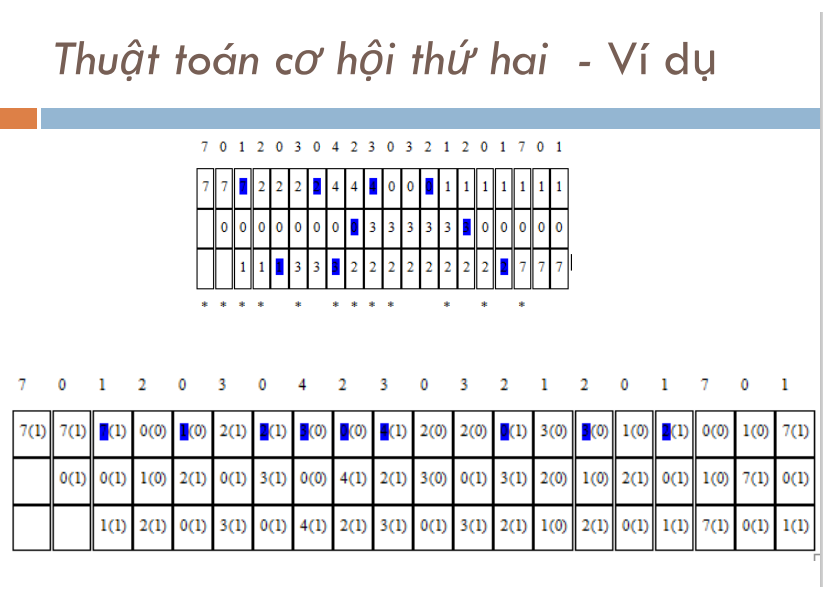

### Mô phỏng giải thuật thay thế trang theo thuật toán cơ hội thứ  - Môn hệ điều hành
- Link tài liệu [ở đây](https://drive.google.com/file/d/1nIsa_igaJTyPx8tDJONT2Y4mC6-yO4vd/view?usp=sharing)
- Ví dụ với số khung trang = 3 và danh sách các trang : 7 0 1 2 0 3 0 4 2 3 0 3 2 1 2 0 1 7 0 1 

